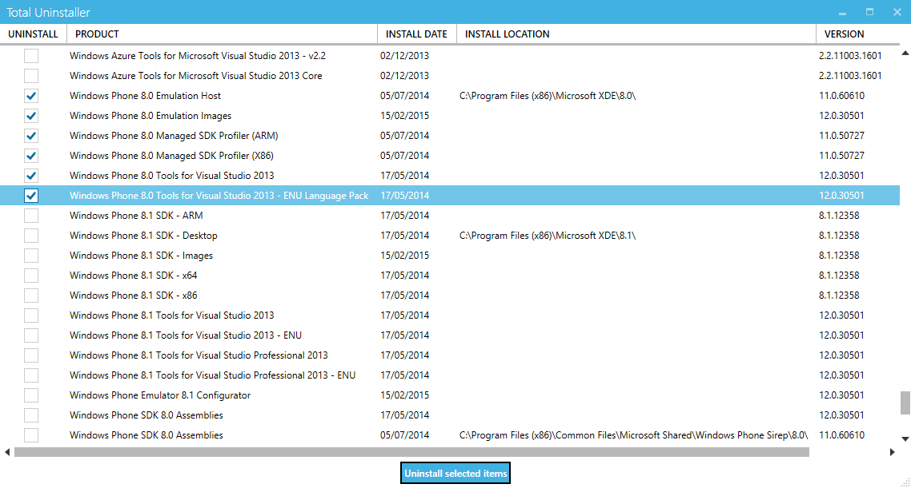

# Total-Uninstaller

Windows software uninstaller. Especially useful for speeding up Visual Studio by removing some of the bloat. Requires admin rights to run. [Download zero install exe](https://github.com/tsasioglu/Total-Uninstaller/releases/download/v1.0.1/TotalUninstaller.exe)

### Troubleshooting

- Right click -> run as admin
- Right click -> properties -> general -> 'Unblock' (You'll only see the option if your local security policy is strict)
- Log location:  %APPDATA%/TotalUninstaller

### Technologies

- WPF
- [MahApps](http://mahapps.com/) UI toolkit
- [Costura.Fody](https://github.com/Fody/Costura) Dependency packaging

Adapted from code by [Konstantin](https://totaluninstaller.codeplex.com/)
